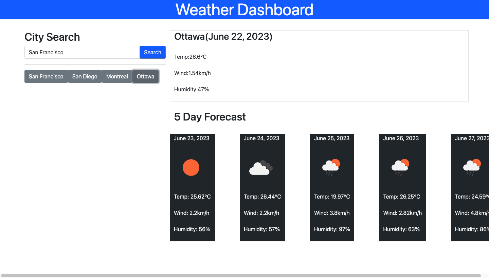

# WeatherDashboard
Weather Dashboard created for CU Bootcamp 2023

This program allows a user to search for a city or region by name and view the current temperature, humidity and wind speed of its specific location. Also included is a 5 day forecast for the chosen city. Once searched, the city is saved in local storage as a button on the left side of the screen that can be clicked to revist that forecast.

screenshot: 

Deployed link: https://beerendan.github.io/WeatherDashboard/